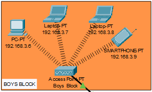

# Campus_Network

## **Introduction :**

Computer networks have a significant impact on the working of an organization. Universities depend on the proper functioning and analysis of their networks for education, administration, communication,  e-library,  automation,  etc. An efficient network is essential to facilitate the systematic and cost-efficient transfer of information in an organization in the form of messages, files, and resources.

## **Aim :**

The aim of this project is to design the topology of the university network using the software Cisco Packet Tracer with the implementation of wireless networking systems. This university network consists of the following devices:

1) Router (1941)
2) Switches (2960-24TT)
3) Email server 
4) DNS server
5) WEB server (HTTP)
6) Wireless Device (Access Point)
7) PCs
8) Laptops 
9) Smart phones

## **Design :**

The design includes the following parts of the University:
Hostel Blocks: Boys Block and Girls Block
Academic Blocks: AB1 and AB2
Dome Building and Library
IT Consulting

In this project, we defined a simulation of campus networks based on wireless networking. The network is divided into two sets: one for the campus area and the other for the hostel area.
The major aim of this project is to show the wireless connectivity that is used in universities to make the network efficient and mobile at the same time. 
Mobility is the major concentration of this project. In order to provide equal functionality to all the users (college staff and students), we have added DNS, Email, and HTTP servers for the maximum utilization of resources. 
As a result, the campus network provides different services such as connecting the user to the internet, data sharing among users (students, teachers, and different university members), accessing different web services for different functionalities, so it needs wireless networking for smooth processing.

## **Terminologies :**

### **Router :**

A router is a device like a switch that routes data packets based on their IP addresses. The router is mainly a Network Layer device. Routers normally connect LANs and WANs together and have a dynamically updating routing table based on which they make decisions on routing the data packets. Router divides broadcast domains of hosts connected through it.

### **Switch :**

A network switch (also called switching hub, bridging hub, officially MAC bridge is networking hardware that connects devices on a computer network by using packet switching to receive and forward data to the destination device. A network switch is a multiport network bridge that uses MAC addresses to forward data at the data link layer (layer 2) of the OSI model. Some switches can also forward data at the network layer (layer 3) by additionally incorporating routing functionality. Such switches are commonly known as layer-3 switches or multilayer switches.

### **Network Packet :**

A network packet is a formatted unit of data carried by a packet-switched network. A packet consists of control information and user data, which is also known as the payload.

### **Server :**

A server is a computer or system that provides resources, data, services, or programs to other computers, known as clients, over a network. In theory, whenever computers share resources with client machines they are considered servers. There are many types of servers, including web servers, mail servers, and virtual servers.
The servers used in our project are as follows:

#### **DNS Server :**

DNS stands for Domain Name System servers which are application servers that provide a human-friendly naming method to the user computers in order to make IP addresses readable by users. The DNS system is a widely distributed database of names and other DNS servers, each of which can be used to request an otherwise unknown computer name. When a user needs the address of a system, it sends a DNS request with the name of the desired resource to a DNS server. The DNS server responds with the necessary IP address from its table of names.

#### **WEB Server :**

One of the widely used servers in today’s market is a web server. A web server is a special kind of application server that hosts programs and data requested by users across the Internet or an intranet. Web servers respond to requests from browsers running on client computers for web pages, or other web-based services. 

#### **EMAIL Server :**

An e-mail server is a server that handles and delivers e-mail over a network, using standard email protocols. For example, the SMTP protocol sends messages and handles outgoing mail requests. The POP3 protocol receives messages and is used to process incoming mail. When you log on to a mail server using a webmail interface or email client, these protocols handle all the connections behind the scenes.

### **Wireless Network  :**

A wireless network broadcasts an access signal to the workstations or PCs. This enables mobility among laptops, tablets, and PCs from room to room while maintaining a firm network connection continuously. A wireless network also presents additional security requirements.

### **Ethernet  :**

This is the backbone of our network. It consists of the cabling and is typically able to transfer data at a rate of 100mb/s. It is a system for connecting a number of computer systems to form a local area network, with protocols to control the passing of information and to avoid simultaneous transmission by two or more systems. Among the different types of ethernet, we have used Gigabit Ethernet, which is a type of Ethernet network capable of transferring data at a rate of 1000 Mbps and fast Ethernet is a type of Ethernet network that can transfer data at a rate of 100 Mbps.

### **Computing Device :**

Computing devices are the electronic devices that take user inputs, process the inputs, and then provide us with the end results. These devices may be Smartphones, PC Desktops, Laptops, printer, and many more.

### **Internet Protocol :**

Internet Protocol (IP) is one of the fundamental protocols that allow the internet to work. IP addresses are a unique set of numbers on each network and they allow machines to address each other across a network. It is implemented on the internet layer in the IP/TCP model.

### **SSH Protocol :**

SSH is a client-server protocol, with an SSH client and an SSH server. The client machine (such as a PC) establishes a connection to an SSH server running on a remote device (such as a router). Once the connection has been established, a network admin can execute commands on the remote device.

## **Work Done :**

In order to make our project understandable, we have divided the content into steps. They are as follows:

### **Network Requirements :**

The University network is divided into 2 areas :

1.Campus Area :
The Campus area is further divided into various accessing points like Dome building, Library, Academic Blocks (AB1 and AB2), Server Center, and IT consulting. 

2.Hostel Area :
The Hostel area is further divided into Boys blocks and Girls blocks respectively.

### **Devices used with respective quantities :**
1) Router (1941)	:   3
2) Switches (2960-24TT) : 	3
3) EMAIL server 	:   1
4) DNS server	:   1
5) WEB server (HTTP)	:   1
6) Wireless Device (Access Point) :	7
7) PCs :	12
8) Laptops :	10
9) Smartphones	: 2

### **Implementation and Flow Diagram :**

1. To design the wireless network of the university we initially started by placing the core devices into the frame as mentioned in the layout. 

2. Firstly, we placed the main router at the center of the university outline, which was further connected to the server switch using the gigabit ethernet port with copper straight-through cable and sub routers (campus router and hostel router) using the serial port with serial DCE cable at the hostel area and campus area respectively.

3. The server switch was further connected to the EMAIL, DNS, and WEB servers respectively.

4. Campus router was connected to the campus switch which was further connected with wireless access points of the academic block (AB1 and AB2), dome building, library, and IT consulting. 

5. The wireless access points were then connected to computing devices (PCs, laptops, and smartphones).

6. Similarly, the hostel router was connected to the hostel switch which was further connected with the wireless access point of boys block and girls block.

7. The wireless access points were then connected to the computing devices (PCs, laptops, and smartphones), every area has a dedicated access point which can only be connected with the help of a password.

8. All these connections are made through ethernet ports (gigabit ethernet and fast ethernet) using copper straight-through cables.

This is the flow diagram for a better understanding of the steps mentioned above.

### **Configuring IP Addresses :**

Main Router configuration :

GigabitEthernet0/1 :

Serial0/1/0 :

Serial0/1/1 :

RIP :

DNS Server :

WEB Server :

EMAIL Server :

College Router :

GigabitEthernet0/0 :

Serial0/1/0 :

Academic Block 1 :

IP Address are as follows

192.168.1.14- Laptop 

192.168.1.15- PC

192.168.1.16- Laptop

192.168.1.17- PC

Subnet Mask- 255.255.255.0

Default Gateway- 192.168.1.1

DNS Server- 192.168.2.3

Academic Block 2 :

IP Address are as follows

192.168.1.10- Laptop 

192.168.1.11- PC

192.168.1.12- Laptop

192.168.1.13- PC

Subnet Mask- 255.255.255.0

Default Gateway- 192.168.1.1

DNS Server- 192.168.2.3

Dome Building :

IP Addresses are as follows

192.168.1.2- PC

192.168.1.3- PC

192.168.1.4- Laptop

Subnet Mask- 255.255.255.0

Default Gateway- 192.168.1.1

DNS Server- 192.168.2.3

Library :

IP Addresses are as follows

192.168.1.5- PC

192.168.1.6- PC

Subnet Mask- 255.255.255.0

Default Gateway- 192.168.1.1

DNS Server- 192.168.2.3

IT Consulting :

IP Addresses are as follows

192.168.1.7- Laptop

192.168.1.8- PC

192.168.1.9- PC

Subnet Mask- 255.255.255.0

Default Gateway- 192.168.1.1

DNS Server- 192.168.2.3

Hostel Router :

GigabitEthernet0/0 :

Serial0/1/0 :

Boys Block :

IP Addresses are as follows

192.168.3.6- PC

192.168.3.7-Laptop

192.168.3.8- PC

192.168.3.9- Smartphone

Subnet Mask- 255.255.255.0

Default Gateway- 192.168.3.1

DNS Server- 192.168.2.3

Girls Block :

IP Addresses are as follows

192.168.3.2- PC

192.168.3.3-Laptop

192.168.3.4- PC

192.168.3.5- Smartphone

Subnet Mask- 255.255.255.0

Default Gateway- 192.168.3.1

DNS Server- 192.168.2.3

Wireless Access Point :

### **Securing the network :**

Passwords are used in accessing the router and all the wireless networks (mentioned in step 5 wireless access point) to make the access limited to University authorized users only. 

Routers are also secured with ssh (Secure Shell). Routers and their assigned passwords are mentioned below:

Router Names and	Passwords :

1)main_router	:

Console password: cisco

ssh password: admin

2)Router1(College Router) :

Console password:muj@123

ssh password: admin

3)Router2(Hostel Router)	:

Console password:muj@123

ssh password: admin

Connectivity of wireless network on computing devices :

### **Result :**

Finally, we have combined all the steps as mentioned above and implemented the desired wireless network for University. We have the complete network providing various facilities to the teaching staff, non-teaching staff, and students.

### **Final Simulation :**

Final simulation for the network system to check all the connections

Ping Test: Network connectivity and communication can be tested using the ping command,  followed by the domain name or the IP address of the device (equipment) whose connectivity one wishes to verify.

Ping Test for EMAIL server

Ping Test for DNS server

Ping Test for WEB server

Website accessed through Web Browser in Packet Tracer :

Email received on device sent through EMAIL server :

THANK YOU!
